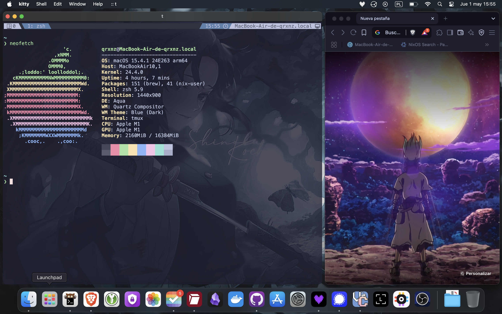

# dotfiles

<p align="center">
  <a href="https://go-skill-icons.vercel.app/">
    
  </a>
</p>

## ✒️ Description

> Linux dotfiles and NixOS configuration built with Snowfall. My setup is tailored for IT security and DevOps tasks

My configuration is tailored for tasks in the areas of DevOps and IT security. The key details I emphasized are reproducibility and a personalized experience to achieve an efficient and enjoyable workflow.

## 🖼️ Gallery

<div style="display: flex; justify-content: center; flex-wrap: wrap;">
    
    
</div>

## ❄️ NixOs Machines

- mentay 🍃
  - **WM:** Hyprland
  - **Shell:** Zsh
  - **Terminal:** Kitty
  - **Additional:** KVM, Docker, Waydroid, AMD GPU support, Development and Creative suites.

### 🧰 features

<details>
<summary>System management tool `sys`</summary>

Rebuild (in flake directory):

```sh
sudo sys rebuild # or `r` as a shorthand
```

Testing an ephemeral config:

```sh
sudo sys test # or `t` as a shorthand
```

Deploying to a server (in flake directory):

```sh
sudo sys deploy HOSTNAME # or `d` as a shorthand
```

</details>

## ⚒️ Installation

### 🐧🍏 non-nixos machines

```sh
git clone --recursive https://github.com/qrxnz/dotfiles  ~/.dotfiles &&\
cd ~/.dotfiles &&\
chmod +x ./setup.sh
```

#### 🐧 Linux

Prerequisite: `stow`, `zsh`, `curl`

- Hyprland dotfiles

> \[!WARNING\]
> Remember to install the necessary packages on your distribution.

```sh
./setup.sh --hyprland-default

```

- Shell only dots

> \[!WARNING\]
> Remember to install the necessary packages on your distribution.

```sh
./setup.sh --shell-only
```

#### 🍏 MacOS

Prerequisite: `homebrew`, `stow`, `curl`

```sh
./setup.sh --macos
```

### ❄️ NixOS Installation

#### Disk Partitioning

First, you need to partition your drive. The following commands will create a GPT partition table and set up partitions for your root, swap, and boot filesystems.

- **Become root:**
  Gain root privileges to manage the disks.

  ```sh
  sudo su
  ```

- **Partition the drive:**
  This example uses `/dev/nvme0n1`. **Make sure to replace this with your actual drive.**
  This creates three partitions:

  - A `512MB` boot partition.
  - An `8GB` swap partition.
  - The rest of the disk for the root (`/`) partition.

  ```sh
  parted /dev/nvme0n1 -- mklabel gpt
  parted /dev/nvme0n1 -- mkpart primary 512MB -8GB
  parted /dev/nvme0n1 -- mkpart primary linux-swap -8GB 100%
  parted /dev/nvme0n1 -- mkpart ESP fat32 1MB 512MB
  parted /dev/nvme0n1 -- set 3 esp on
  ```

- **Format and mount partitions:**
  Next, format the partitions with the appropriate filesystems and mount them.

  ```sh
  mkfs.ext4 -L nixos /dev/nvme0n1p1
  mkswap -L swap /dev/nvme0n1p2
  mkfs.fat -F 32 -n boot /dev/nvme0n1p3
  mount /dev/disk/by-label/nixos /mnt
  mkdir -p /mnt/boot
  mount /dev/disk/by-label/boot /mnt/boot
  swapon /dev/nvme0n1p2
  ```

#### Final Installation Steps

Now you can clone the dotfiles and install NixOS.

- **Clone the repository:**
  Clone this repository into the `/mnt` directory.

  ```sh
  git clone --recursive https://github.com/qrxnz/dotfiles .dotfiles &&\
  cd .dotfiles
  ```

- **Generate hardware configuration:**
  Let NixOS generate a hardware configuration file for your system and then copy it into the systems directory of this flake. **Replace `hostname` with the desired hostname for your new system (e.g., `mentay`).**

  ```sh
  nixos-generate-config --root /mnt &&\
  cp /mnt/etc/nixos/hardware-configuration.nix .dotfiles/systems/x86_64-linux/hostname/
  ```

- **Install NixOS:**
  Finally, install NixOS using the flake. **Remember to replace `hostname` with the one you chose previously.**

  ```sh
  nixos-install --flake .#hostname
  ```

### 👾 Others

#### 🍕 Tmux

If you want to use my tmux configuration, I recommend installing it through nix profile

```sh
nix profile install github:qrxnz/tmux-flake
```

#### 🐱 Neovim

If you want to use my neovim configuration, I recommend installing it through nix profile

```sh
nix profile install github:qrxnz/nveem
```

Or you can install it directly

```sh
git clone https://github.com/qrxnz/nveem.git --depth=1 ~/.config/nvim/ && nvim
```

## 🗒️ Credits

### 🎨 Inspiration

I was inspired by:

- [jazzpiazz](https://github.com/jazzpizazz/zsh-aliases)
- [ptrcnull](https://github.com/ptrcnull/dotfiles)
- [omerxx](https://github.com/omerxx/dotfiles)
- [IogaMaster](https://github.com/IogaMaster/dotfiles)
- [ryan4yin](https://github.com/ryan4yin/nix-config)
- [redyf](https://github.com/redyf/nixdots)
- [Usergh0st](https://github.com/Usergh0st/bspwm)

### 🐈 Theme

I use [Catppuccin](https://catppuccin.com/) in every part of my config!

### ❤️ Special thanks

To [redyf](https://github.com/redyf/wallpapers) for the amazing wallpapers & [IogaMaster](https://github.com/IogaMaster) for [snowfall-starter](https://github.com/IogaMaster/snowfall-starter)
