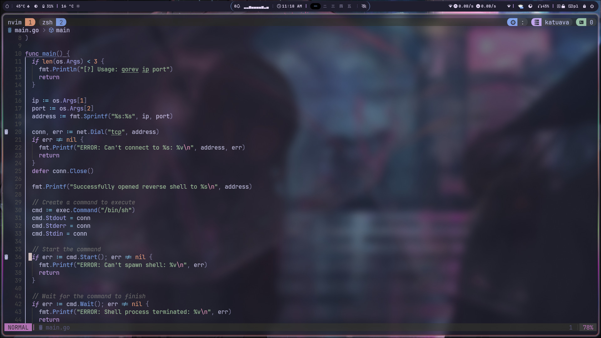

# dotfiles

## 🖼️ Gallery



## ❗ Prerequisite

soon ...

### 📦 Dependencies

## ⌨️ Keybinds
Most of the keyboard shortcuts in my hyprland are compatible with the default bspwm shortcuts

## ⚒️ Installation
```sh
git clone --recursive https://github.com/qrxnz/dotfiles  ~/.dotfiles &&\
cd ~/.dotfiles &&\
chmod +x setup.sh &&\
./setup.sh
```
## 🗒️ Credits

### 🎨 Inspiration

I was inspired by:
- [jazzpiazz](https://github.com/jazzpizazz/zsh-aliases)
- [ptrcnull](https://github.com/ptrcnull/dotfiles)
- [omerxx](https://github.com/omerxx/dotfiles)
- [IogaMaster](https://github.com/IogaMaster/neovim)
- [ryan4yin](https://github.com/ryan4yin/nix-config)

### 🐱 Theme
I use [Catppuccin](https://catppuccin.com/) in every part of my config!

### ❤️ Special thanks
To [bashbunni](https://github.com/bashbunni/wallpapers) for the amazing wallpapers
