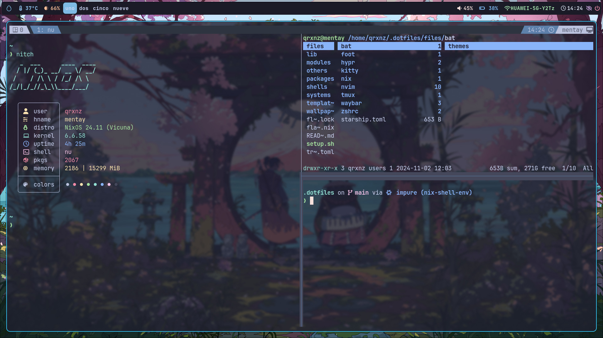
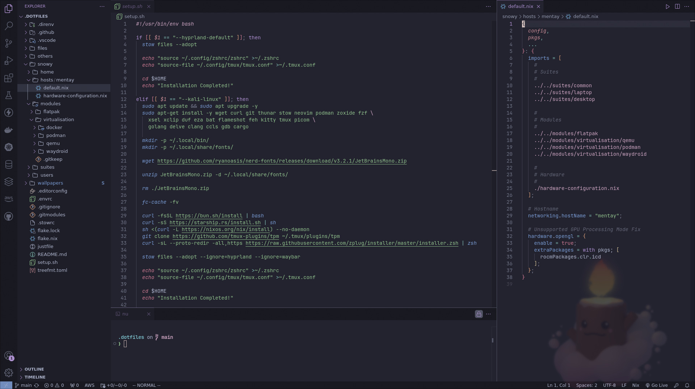
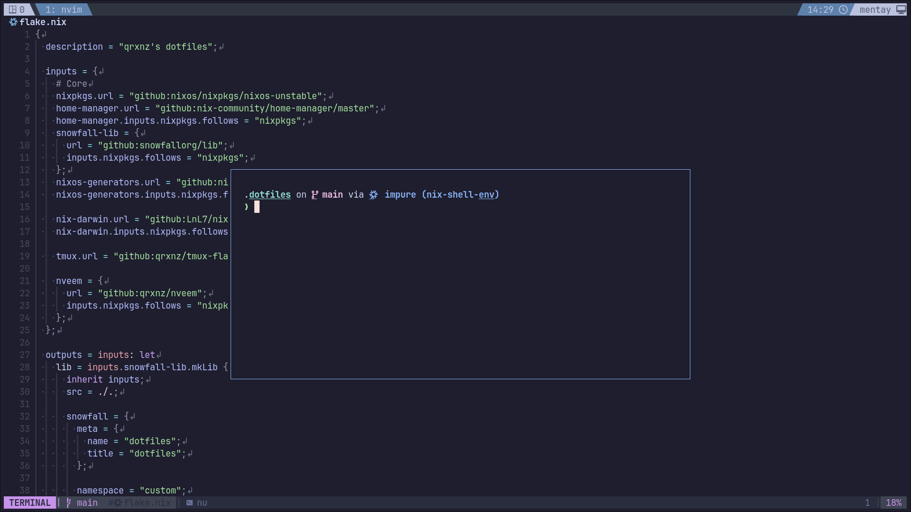

# dotfiles

<p align="center">
  <a href="https://go-skill-icons.vercel.app/">
    
  </a>
</p>

## ✒️ Description
> Linux dotfiles and NixOS configuration built with Snowfall. My setup is tailored for IT security and DevOps tasks

My configuration is tailored for tasks in the areas of DevOps and IT security. The key details I emphasized are reproducibility and a personalized experience to achieve an efficient and enjoyable workflow.

## 🖼️ Gallery

<div style="display: flex; justify-content: center; flex-wrap: wrap;">
    
    
    
</div>

## ❄️ NixOs Machines

-  mentay

soon ...

### 🧰 features

<details>
<summary>System management tool `sys`</summary>

Rebuild (in flake directory)

```sh
sudo sys rebuild # or `r` as a shorthand
```

Testing an ephemeral config

```sh
sudo sys test # or `t` as a shorthand
```

Deploying to a server (in flake directory)

```sh
sudo sys deploy HOSTNAME # or `d` as a shorthand
```

</details>

## ⚒️ Installation

### 🐧 non-nixos machines

prerequisite: `git`, `stow`

```sh
git clone --recursive https://github.com/qrxnz/dotfiles  ~/.dotfiles &&\
cd ~/.dotfiles &&\
chmod +x ./setup.sh
```

-  Hyprland dotfiles

> \[!WARNING\]
> Remember to install the necessary packages on your distribution.

```sh
./setup.sh --hyprland-default
```

### ❄️ nixos machines

soon ...

### 👾 Others

#### 🍕 Tmux

If you want to use my tmux configuration, I recommend installing it through nix profile

```sh
nix profile install github:qrxnz/tmux-flake
```
#### 🐱 Neovim

If you want to use my neovim configuration, I recommend installing it through nix profile

```sh
nix profile install github:qrxnz/nveem
```

Or you can install it directly

```sh
git clone https://github.com/qrxnz/nveem.git --depth=1 ~/.config/nvim/ && nvim
```

## 🗒️ Credits

### 🎨 Inspiration

I was inspired by:

- [jazzpiazz](https://github.com/jazzpizazz/zsh-aliases)
- [ptrcnull](https://github.com/ptrcnull/dotfiles)
- [omerxx](https://github.com/omerxx/dotfiles)
- [IogaMaster](https://github.com/IogaMaster/dotfiles)
- [ryan4yin](https://github.com/ryan4yin/nix-config)
- [redyf](https://github.com/redyf/nixdots)

### 🐈 Theme

I use [Catppuccin](https://catppuccin.com/) in every part of my config!

### ❤️ Special thanks

To [redyf](https://github.com/redyf/wallpapers) for the amazing wallpapers & [IogaMaster](https://github.com/IogaMaster) for [snowfall-starter](https://github.com/IogaMaster/snowfall-starter)
