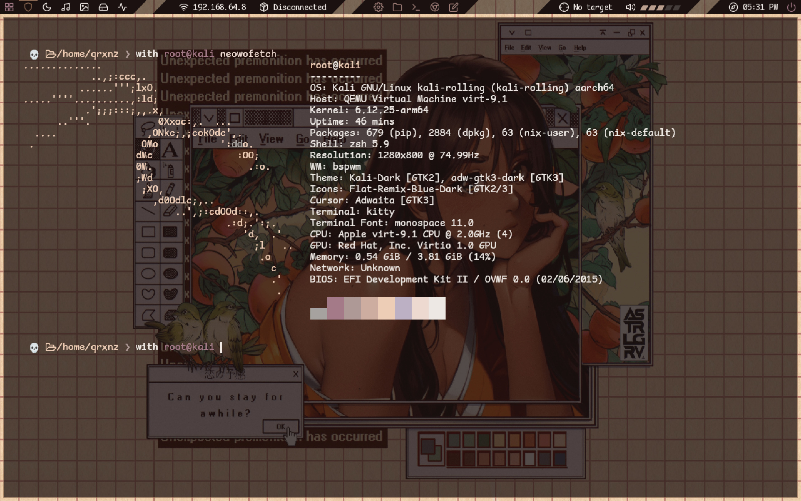

# dotfiles

<p align="center">
  <a href="https://go-skill-icons.vercel.app/">
    
  </a>
</p>

## ✒️ Description
> Linux dotfiles and NixOS configuration built with Snowfall. My setup is tailored for IT security and DevOps tasks

My configuration is tailored for tasks in the areas of DevOps and IT security. The key details I emphasized are reproducibility and a personalized experience to achieve an efficient and enjoyable workflow.

## 🖼️ Gallery

### 💧 Hyprland


### 🐲 Kali


### 📝 Vscodium


### 🐱 Neovim


## 🖥️ Machines

### ❄️ nixos

- 🍃 mentay

- VMs

soon ...

### 🧰 features

<details>
<summary>system managment</summary>

- System management tool `sys`

Rebuild (in flake directory)

```sh
sudo sys rebuild # or `r` as a shorthand
```

Testing an ephemeral config

```sh
sudo sys test # or `t` as a shorthand
```

Deploying to a server (in flake directory)

```sh
sudo sys deploy HOSTNAME # or `d` as a shorthand
```

</details>

### 🐧 non-nixos machines

- VMs
  - 🐲 Kali
    soon ...

## ⌨️ Keybinds

### 💧 Hyprland

Most of the keyboard shortcuts in my hyprland are compatible with the default bspwm shortcuts

### 🍕 Tmux

soon ...

### 🐱 Neovim

soon ...

## ⚒️ Installation

### 🐧 non-nixos machines

```sh
git clone --recursive https://github.com/qrxnz/dotfiles  ~/.dotfiles &&\
cd ~/.dotfiles &&\
chmod +x ./setup.sh
```

- 💧 Hyprland dotfiles

> \[!WARNING\]
> Remember to install the dependencies listed in the 'Prerequisite' section on your distribution.

<details>
<summary>❗ Prerequisite</summary>

- 🔌 Plugin managers

  - [zplug](https://github.com/zplug/zplug)
  - [tpm](https://github.com/tmux-plugins/tpm)

- 🐱 Neovim

  - lsp

    - [lua-language-server](https://github.com/neovim/nvim-lspconfig/blob/master/doc/configs.md#lua_ls)
    - [typescript-language-server](https://github.com/neovim/nvim-lspconfig/blob/master/doc/configs.md#ts_ls)
    - [vuels](https://github.com/neovim/nvim-lspconfig/blob/master/doc/configs.md#vuels)
    - [emmet-ls](https://github.com/aca/emmet-ls)
    - [clangd](https://github.com/neovim/nvim-lspconfig/blob/master/doc/configs.md#clangd)
    - [tailwindcss-language-server](https://github.com/neovim/nvim-lspconfig/blob/master/doc/configs.md#tailwindcss)
    - [gopls](https://github.com/neovim/nvim-lspconfig/blob/master/doc/configs.md#gopls)
    - [sqls](https://github.com/neovim/nvim-lspconfig/blob/master/doc/configs.md#sqls)
    - [basedpyright](https://github.com/neovim/nvim-lspconfig/blob/master/doc/configs.md#basedpyright)

  - debug adapters

    - [delve](https://github.com/mfussenegger/nvim-dap/wiki/Debug-Adapter-installation#go-using-delve-directly)
    - [codelldb](<https://github.com/mfussenegger/nvim-dap/wiki/C-C---Rust-(via--codelldb)>)

  - formatters

    - clang-format
    - gofmt
    - sql-formatter
    - stylua
    - alejandra
    - black
    - mdformat
    - prettier

- 💲 Shell (zsh)

  - [git](https://git-scm.com/)
  - [eza](https://github.com/eza-community/eza)
  - [bat](https://github.com/sharkdp/bat)
  - [zoxide](https://github.com/ajeetdsouza/zoxide)
  - [tmux](https://github.com/tmux/tmux)
  - [kitty](https://sw.kovidgoyal.net/kitty/)
  - [wl-copy](https://github.com/bugaevc/wl-clipboard)
  - [neovim](https://github.com/neovim)
  - [direnv](https://direnv.net/)
  - [nmap](https://nmap.org/)
  - [metasploit](https://www.metasploit.com/)
  - [wfuzz](https://github.com/xmendez/wfuzz)
  - [hexyl](https://github.com/sharkdp/hexyl)
  - [seclists](https://github.com/danielmiessler/SecLists)
  - [yt-dlp](https://github.com/yt-dlp/yt-dlp)
  - [duf](https://github.com/muesli/duf)
  - [john the ripper](https://www.openwall.com/john/)
  - [starship](https://starship.rs/)
  - [nix](https://nixos.org/download/)

</details>

```sh
./setup.sh --hyprland-default
```

- 🐲 Full Kali linux setup

```sh
./setup.sh --kali-linux
```

### ❄️ nixos machines

soon ...

### 🍕 Tmux

If you want to use my tmux configuration, I recommend installing it through nix profile

```sh
nix profile install github:qrxnz/tmux-flake
```

## 🗒️ Credits

### 🎨 Inspiration

I was inspired by:

- [jazzpiazz](https://github.com/jazzpizazz/zsh-aliases)
- [ptrcnull](https://github.com/ptrcnull/dotfiles)
- [omerxx](https://github.com/omerxx/dotfiles)
- [IogaMaster](https://github.com/IogaMaster/dotfiles)
- [ryan4yin](https://github.com/ryan4yin/nix-config)
- [redyf](https://github.com/redyf/nixdots)

### 🐱‍💻 Theme

I use [Catppuccin](https://catppuccin.com/) in every part of my config!

### ❤️ Special thanks

To [redyf](https://github.com/redyf/wallpapers) for the amazing wallpapers & [IogaMaster](https://github.com/IogaMaster) for [snowfall-starter](https://github.com/IogaMaster/snowfall-starter)
